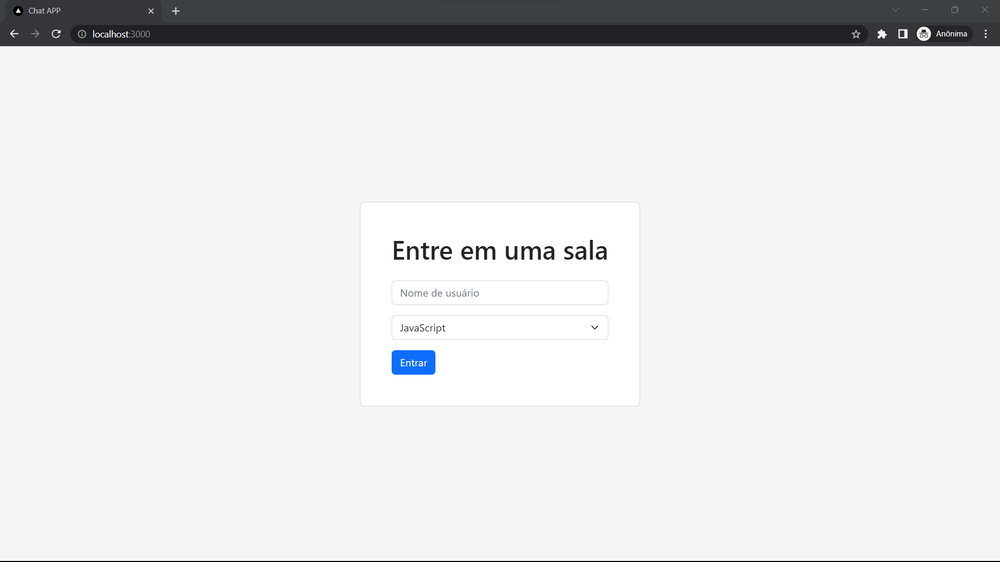
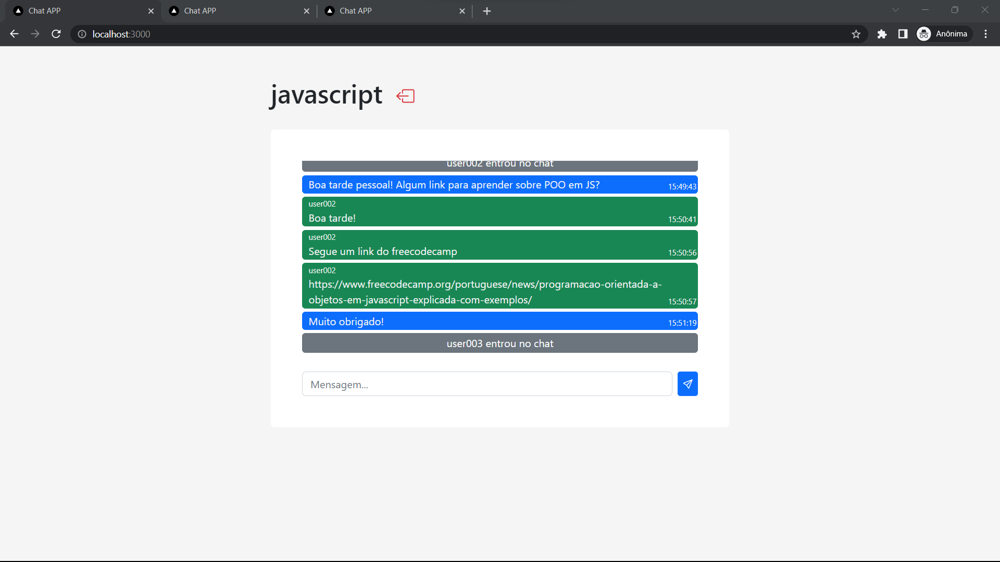

# Learning Logs

Chat app built with Express, Next and Socket.io.

## Screenshots

### Enter room page



### Chat page



## Goals

App developed in order to put into practice my studies on Express, Next and Socket.io.  
Some of the concepts I was able to put into practice:

- Create a Socket.io server
- Create a connection with Socket.io server
- Listen to Socket.io events
- Emit Socket.io events

## Tools


## Run locally

The first thing to do is to clone the repository:

```sh
git clone https://github.com/ogaaabriel/chat_app.git
cd chat_app
```

Open two terminal windows and then install the dependencies:

```sh
cd frontend
npm install
```

```sh
cd backend
npm install
```

Once `npm` has finished downloading the dependencies run the following command in both terminal windows:

```sh
npm run dev
```

And navigate to `http://localhost:3000`.
